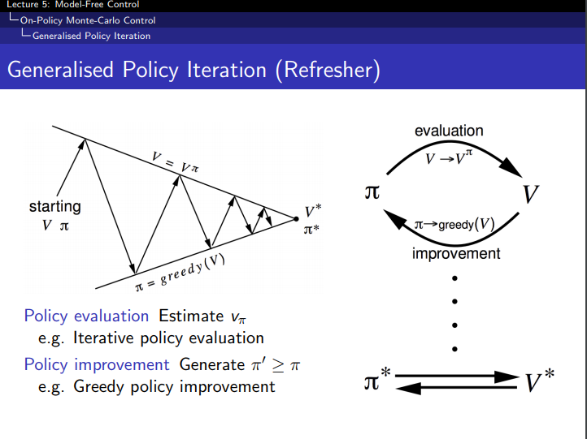
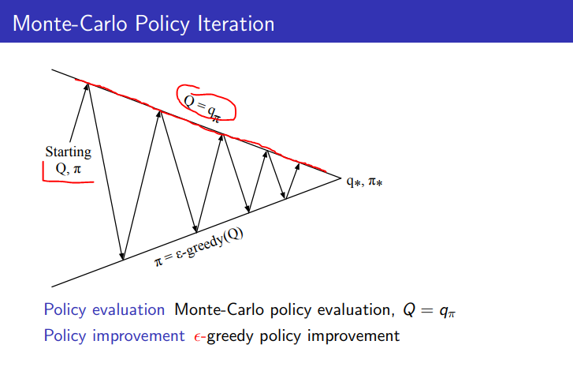
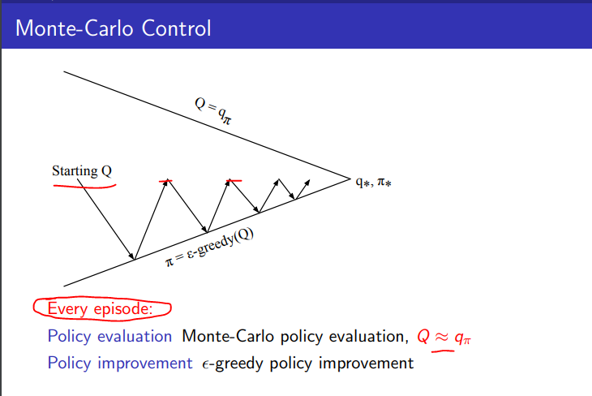

## 说明

解决无模型预测和无模型控制的问题. 包含两个部分

* 策略评估 (policy evaluation)
* 策略控制 (policy control)

策略评估用于评估策略的好坏,而策略控制用来改进策略, 这里我们只讨论策略控制. 也就是结合策略评估提升策略的方法.

包含以下几个方面

* On-policy Monte Carlo control
* On-policy Temporal Difference control
* Off-policy learning

On-policy 学习
* "Learn on the job"
* Learn about policy $\pi$ from experience sampled from $\pi$

简言之, 一边干一边学, 从自身的经验中学习.

Off-policy 学习
* "Look over someone's shoulder"
* Learn about policy $\pi$ from experience sampled from $\mu$

简言之, 从别人的(服从其他策略的回合经验)中学习. 这种学习应当是离线的,不能一边干一边学.

直接的想法当然是Off-policy和On-policy结合使用啦.

## 通用的策略迭代框架

## On-policy Monte Carlo control

### 价值函数

如果采用Greedy policy improvement,我们将使用什么价值函数来对策略进行评估?

1. 采用状态-价值函数V(s), greedy policy improvement的更新
$$ \pi^\prime(s) = \mathop{\arg\max}_{a \in A} R_s^a + P_{ss^\prime}^aV(s^\prime) $$

2. 采用动作状态-价值函数Q(s,a), greedy policy improvement的更新
$$ \pi^\prime(s) = \mathop{\arg\max_{a \in A} Q(s, a)} $$

价值函数将由策略评估来估计, 如果采用状态-价值函数的话，在策略控制中还需要一个执行动作a后的状态转移概率，这个信息是mdp模型信息，在无模型信息的策略控制中就还需要额外的过程来估计这个信息，所以不如直接使用动作状态-价值函数Q(s,a)

### $\epsilon$ -Greedy Exploration

增强学习的特有问题, exploration-exploitation-dilemma, 不能简单执行贪婪的算法，总是简单的选择最大收益的动作, 需要有一些机会来进行探索. 对贪婪算法最简单直接的改进

* 所有m个动作都需要有非零概率以便被尝试过
* 以概率 $(1-\epsilon)$ 选择贪婪动作, 即选取收益最大的动作exploitation
* 以概率 $\epsilon$ 选择去探索, 即以概率 )$\frac{\epsilon}{m}$ 随机选取动作

$$ \begin{equation}
\pi(a|s) =
\begin{cases}
\epsilon / m + 1 - \epsilon & {if \space a^* = \mathop{\arg\max}_{a \in A} Q(s,a) }\\
\epsilon / m & \text{otherwise}
\end{cases}
\end{equation} $$  

$\epsilon$ -Greedy Policy Improvement是确保新策略一定好于至少等于旧策略. 也就是保证策略是提升的.
直觉上是很清楚的，但是整个证明过程我没有完全明白

$$ q_\pi (s, \pi^\prime(s)) = \sum_{a \in A} \pi^\prime(a|s) q_{\pi}(s,a) $$
$$ = \epsilon / m \sum_{a \in A} q_\pi(s,a) + (1-\epsilon) \mathop{\max_{a \in A}}q_\pi(s,a) $$
$$ \ge \epsilon / m \sum_{a \in A} q_\pi(s,a) + (1-\epsilon) \sum_{a \in A} \frac{\pi(a|s)-\epsilon/m}{1-\epsilon} q_\pi(s,a) $$
$$ = \sum_{a \in A} \pi(a|s)q_\pi(s,a) = v_\pi(s)$$

* 思路是计算基于新策略选择动作后的价值函数要大于旧策略的价值函数. 价值函数分两个部分,一个部分是以概率 $\epsilon / m$ 探索,其产生的价值不会有差异. 第二个部分是根据策略选择已知最优动作而产生的价值.
* 直觉上很清楚，在经过可能发生的新的探索后, 对模型的信息有增益, 据此用贪婪算法选择的最优动作产生的价值会大于基于更少信息的旧策略的贪婪算法选择动作产生的价值

### Monte Carlo Control的策略迭代

* 由任意一个价值函数Q和策略 $\pi$ 开始
* 采用MC的方法, 即服从策略 $\pi$ 的条件下运行很多个回合, 来估计策略 $\pi$ 的动作状态-价值函数
* 在对策略估计完成后, 采用 $\epsilon$-greedy 策略提升的方法更新策略到 $\pi^\prime$
* 反复迭代直至收敛到贪婪算法下的最优价值函数和最优策略

缺点是效率低下

一个直接的改进以提高效率的做法是在策略评估时,不是先执行多个回合然后评估一个准确的Q然后进行策略提升,而是在一个回合之后评估得到一个新的Q之后就立即进行策略提升. 有点类似Stochastic gradient descent的方式.

### Greedy in the Limit with Infinite Exploration (GLIE)

定义

* 所有的状态-动作对应当能无限多次的被尝试到
$$ \lim_{k \rightarrow \infty} N_k(s,a) = \infty$$
* 策略应当收敛到一个贪婪策略
$$ \lim_{k \rightarrow \infty} \pi_k (a|s) = I(a= \mathop{\arg\max_{a^\prime \in A}} Q_k(s,a)) $$

例如 当 $\epsilon_k = \frac{1}{k}$ 时,随着k增大, $\epsilon$ 趋近于0, 此时的 $\epsilon-greedy$ 符合GLIE

### GLIE Monte Carlo Control的策略迭代

* 使用策略 $\pi$, 进行第k个回合的采样
* 对于该回合中的每个状态 $S_t$ 和动作 $A_t$, 使用下面的方式更新状态动作-价值函数 Q
$$ N(S_t, A_t) \leftarrow N(S_t,A_t) + 1 $$
$$ Q(S_t, A_t) \leftarrow Q(S_t,A_t) + \frac{1}{N(S_t,A_t)(G_t-Q(S_t,A_t))}$$
* 使用 $\epsilon-greedy$ 进行策略提升

## 参考

http://www0.cs.ucl.ac.uk/staff/D.Silver/web/Teaching_files/control.pdf
