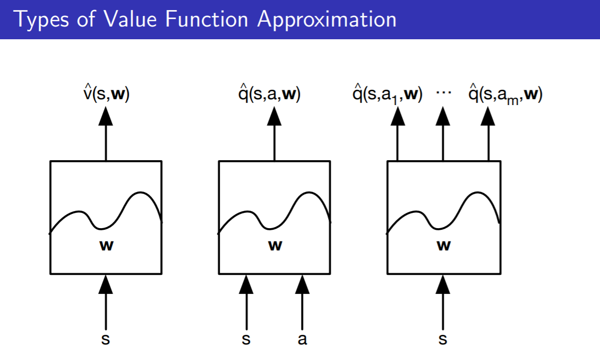
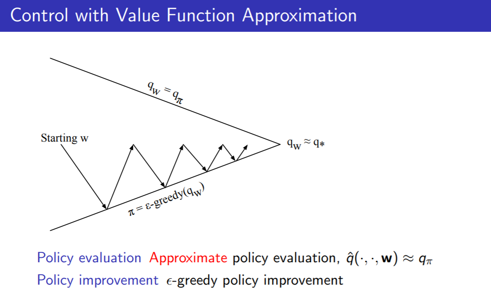
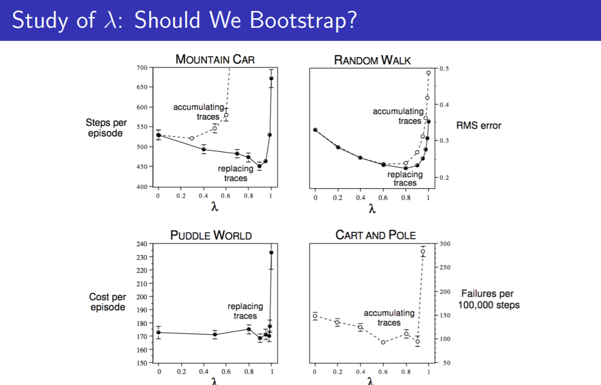
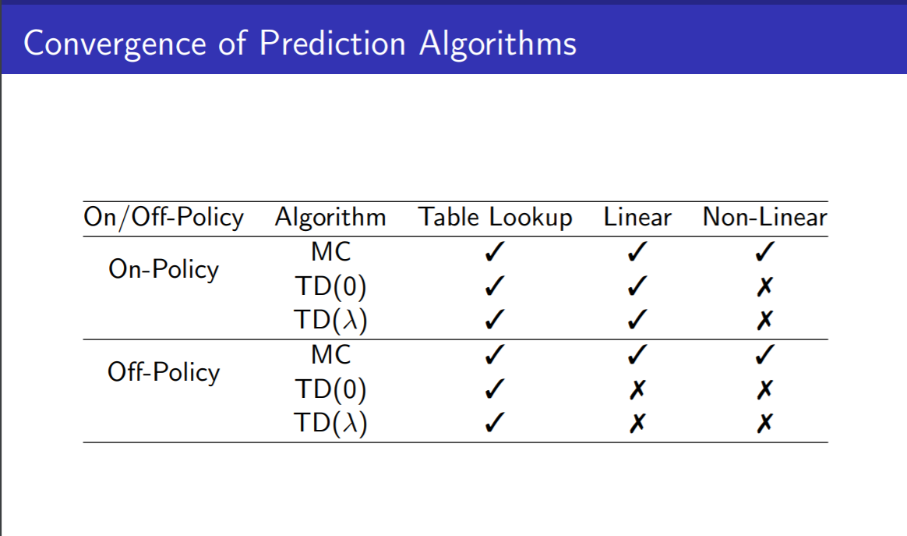
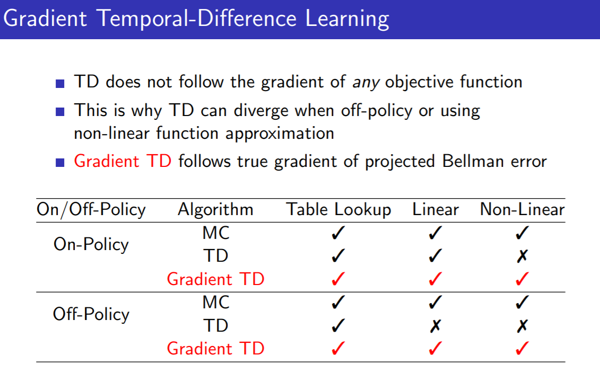
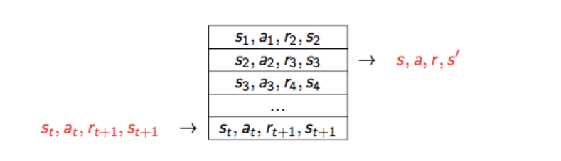
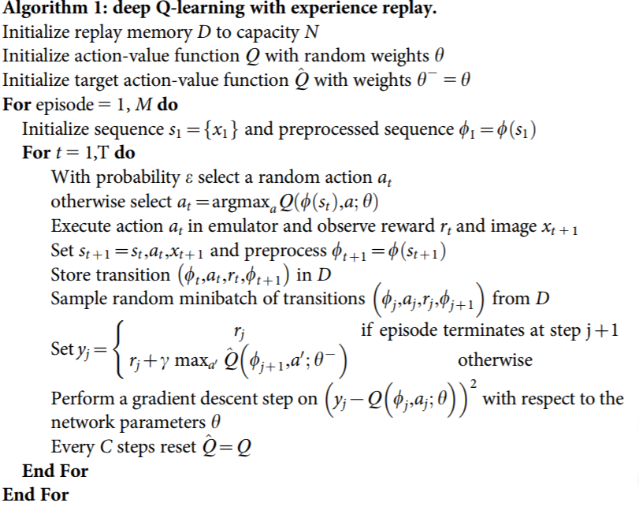
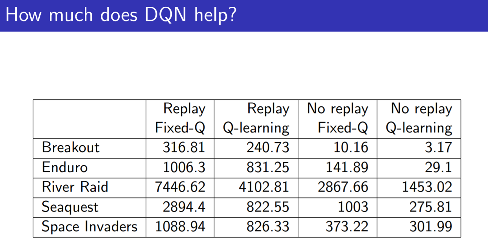

## 说明

### 待解决的问题

* 对于状态和行为空间特别大,或者是在连续状态和行为空间
* 在经验数据量比较小的情况下, 或者说做一次实验的成本非常高的情况下, 查表法对每个独立的状态都需要学习其价值函数, 学习速度太慢有时成本太高了, 必须要利用类似的状态和动作来进行估计.

注: 在讲座中当用线性近似时,关于特征,在实践中是需要做特征构造的. 说白了是linear regression with kernel. 常用的构造方法(kernel)有多项式变换, 傅里叶基, Coarse coding, Tile coding, RBF. 在reinforcement learning an introduction的第9章有谈到.

### 解决方法
* 利用函数近似的方法来估计价值函数
$$ \hat{v}(s,w) \approx v_\pi(s) $$
$$ \hat{q}(s,a,w) \approx q_\pi(s,a) $$
* 从已观测过的状态泛化到未观测过状态的价值函数估计
* 利用MC或者TD learning来更新价值函数中的参数w

### 近似函数的三种类型

1. 针对状态本身，输出这个状态的近似价值, V价值函数
2. 针对状态行为对，输出状态行为对的近似价值, Q价值函数 action-in.
3. 针对状态本身，输出一个向量，向量中的每一个元素是该状态下采取一种可能行为的价值. action-out

### 有哪些近似函数 Which Function Approximator

实际上就是机器学习中的监督学习,而且主要是回归器

* 线性回归
* 神经网络
* 决策树
* KNN
* 傅里叶/小波基
* ...

本文主要考虑, 线性回归和神经网络, 这两类方法是一个针对状态可导的近似函数.

同时, 强化学习应用的场景其数据通常是非静态、非独立均匀分布的，因为一个状态数据是可能是持续流入的，而且下一个状态通常与前一个状态是高度相关的. 因此，我们需要一个适用于非静态、非独立均匀分布的数据的训练方法来得到近似函数.  

## 递增方法 Incremental Methods

就是Stochastic (Online) gradient descent方法.

### 梯度下降

假定J(w)是一个关于参数w的可微函数，定义J(w)的梯度如下

$$\nabla_w J(w) = \left(
  \begin{aligned}
  \frac{\partial J(w)}{w_1} \\
  \frac{\partial J(w)}{w_2} \\
  ... \\
  \frac{\partial J(w)}{w_n}
  \end{aligned}
  \right)$$

这里J(w)就是监督学习中的代价函数(cost function), 回归问题中最最常见的就是均方差(mean square error)

目标是调整w使代价函数J(w)最小.

每次调整w时, 是朝着负梯度的方向, 调整量

$$ \Delta_w = -\frac{1}{2} \alpha \nabla_w J(w) $$

$\alpha$ 为步长, 是个超参

### 用随机梯度下降方法做价值函数近似

目标：找到参数向量w，最小化近似函数 $\hat{v}(S,w)$ 与实际函数 $v_{\pi}(S)$ 的均方差

$$ J(w) = E_\pi[(v_\pi(S) - \hat{v}(S,w))^2 ] $$

梯度下降能够找到局部最小值

$$ \Delta_w = -\frac{1}{2} \alpha \nabla_w J(w) \\
= \alpha E_\pi[(v_\pi(S) - \hat{v}(S,w)) \nabla_w \hat{v}(S,w)]  $$

随机梯度下降实际上是对梯度的一个采样

$$ \Delta_w = \alpha (v_\pi(S) - \hat{v}(S,w)) \nabla_w \hat{v}(S,w) $$

Expected update is equal to full gradient update.   
期望的更新量等于全部的梯度更新总量

### 线性函数的近似 Linear Function Approximation

用一个特征向量(Feature Vector, Not Eigen Vector)表示一个状态，每一个状态是由以w表示的不同强度的特征来线性组合得到

$$ x(S) = \left(
  \begin{aligned}
  x_1(S) \\
  x_2(S) \\
  ... \\
  x_3(S)
  \end{aligned}
  \right)$$

可以通过对特征的线性求和来近似价值函数, (最基本的线性回归, 没有L1,L2正则)

$$ \hat{v}(S,w)) = x^T(S) w = \sum_j^n x_j(S)w_j $$

目标函数(代价函数)定义为均方差

$$ J(w) = E_\pi [( v_\pi(S) - \hat{v}(S,w))^2]$$

参数更新

$$ \begin{aligned}
\Delta_w = \alpha (v_\pi(S) - \hat{v}(S,w)) \nabla_w \hat{v}(S,w) \\
= \alpha (v_\pi(S) - \hat{v}(S,w)) x(S)
\end{aligned} $$

参数更新量 = 步长 × 预测误差 × 特征值

"查表"方法其实可以看作一个特殊的线性价值函数近似方法,每一个状态看成一个特征,个体具体处在某一个状态时,该状态特征取1,其余取0 (one-hot encoding)

### 增量预测算法 Incremental Prediction Algorithms

#### 介绍

在前面的讨论中,用到机器学习中的监督学习,而监督学习中是需要知道被近似函数的真实值的. 然后用近似函数的估计值和真实值对比, 计算代价, 然后调整近似函数来减少代价.

在增强学习中只有即时奖励, 没有监督数据. 我们要找到能替代 $v_{\pi}(S)$ 的目标值作为监督数据，以便来使用监督学习的算法学习到近似函数的参数。

对于MC算法，目标值就是返回(Return $G_t$), $G_t$ 是$v_{\pi}(S)$ 的无偏估计, 我们用其作为监督数据来进行学习.

$$ \Delta_w = \alpha (\color{red}{G_t} - \hat{v}(S_t, w)) \nabla_w \hat{v}(S_t,w) $$

对于TD(0)，目标值就是TD目标,

$$ \Delta_w = \alpha (\color{red}{R_{t+1}+\gamma \hat{v}(S_{t+1}, w)} - \hat{v}(S_t,w)) \nabla_w \hat{v}(S_t,w) $$

这里有一个有趣的问题, 在TD Target中包含有 $\gamma \hat{v}(S_{t+1},w)$  也包含参数w, 在讲座中是把整个TD Target作为固定值,所以求梯度时不包含 $\nabla_w \gamma \hat{v}(S_{t+1},w)$ .

如果不作为固定值, 则正确的(负)梯度应该是  $\nabla_w (-\gamma\hat{v}(S_{t+1},w)+\hat{v}(S_t,w))$.
直觉上好像是需要作为固定值的, 应该不可以动态的调整监督学习的目标值. 和EM算法有点类似,需要固定住一个目标, 然后更新w.
讲座中在第48分钟也谈到这个问题. 并且说到实践中有人尝试过同时更新目标值,会导致得到错误的答案.

对于TD(λ)，目标值是λ返回

$$ \Delta_w = \alpha ( \color{red}{G_t^\lambda} - \hat{v}(S_t,w)) \nabla_w \hat{v}(S_t,w)  $$

我觉得这里最好把 $G_t^\lambda$ 作为固定值

#### MC应用于状态价值函数近似

收获 $G_t$ 是真实价值 $V_{\pi}(S_t)$ 的有噪声、无偏采样，可以把它看成是监督学习的标签数据带入机器学习算法进行学习，这样(监督学习)训练数据集可以是

$$ <S_1, G_1>, <S_2, G_2>, ..., <S_T, G_T> $$

如果使用线性蒙特卡洛策略迭代，那么每次参数的修正值则为

$$ \begin{aligned}
\Delta_w = \alpha (G_t - \hat{v}(S_t,w)) \nabla_w \hat{v}(S,w) \\
= \alpha (G_t - \hat{v}(S_t,w)) x(S_t)
\end{aligned} $$

* 蒙特卡洛策略迭代使用线性函数近似时也是收敛至一个全局最优解.
* 蒙特卡洛策略迭代使用非线性函数近似时也可以收敛至一个局部最优解.

#### TD应用于状态价值函数近似

TD目标值是真实价值的有噪声、有偏采样。此时的训练数据集是,

$$ <S_1, R_2+\gamma \hat{v}(S_2,w)>, <S_2, R_3+\gamma \hat{v}(S_3,w)>, ..., <S_{T-1}, R_T+\gamma \hat{v}(S_T,w)> $$

如果使用线性TD(0)学习，则有

$$ \begin{aligned}
\Delta_w = \alpha (R + \gamma \hat{v}(S^\prime, w) - \hat{v}(S_t,w)) \nabla_w \hat{v}(S,w) \\
= \alpha \delta x(S)
\end{aligned} $$

* 线性TD(0) 收敛(或逼近) 全局最优解

#### TD(λ)应用于状态价值函数近似

TD(λ)目标值是真实价值的有噪声、有偏采样。此时的训练数据集

$$ <S_1, G_1^\lambda>, <S_2, G_2^\lambda>, ..., <S_T, G_T^\lambda> $$

线性TD(λ)学习，前向视图

$$ \begin{aligned}
\Delta_w = \alpha (G_t^\lambda - \hat{v}(S_t,w)) \nabla_w \hat{v}(S,w) \\
= \alpha (G_t^\lambda - \hat{v}(S_t,w)) x(S)
\end{aligned} $$

线性TD(λ)学习，后向视图

$$ \delta_t = R_{t+1}+\gamma \hat{v}(S_{t+1}, w) - \hat{v}(S_t,w) \tag{TD Error} $$
$$ E_t = \gamma \lambda E_{t-1} + x(S_t) \tag{Eligibility Trace} $$
$$ \Delta_w = \alpha \delta_t E_t \tag{Weights update} $$

通过累积求和,可以得到前向后向视图是一致的

### 增量控制算法

在继续学习之前,首先自我考虑下如何做控制算法

* 首先需要用Q价值函数,需要联合考虑状态S和动作A
* 动作A是有限的离散的, 采用 $\epsilon$-greedy 进行improvement时, 可以用action-in的方式进行尝试.
* 如果动作是在连续空间中, 可以考虑和策略评估同样的思路. 在策略评估过程中是给定S,A调整w去最小化代价函数J(w). 而这里可以是固定S和w,来调整A去最大化价值函数Q(S,A,w). 如果不方便直接最大化,可以用梯度提升的方法, 也就是给出的算法下的A是不断用步长和Q(S,A,w)的梯度不断调整的(如果策略评估是用神经网络,那这个策略提升可能是另一个神经网络). 当然,有可能是需要考虑exploration-expolitation的问题的.

#### 动作价值函数近似

* 近似动作价值函数
$$ \hat{q}(S,A,w) \approx q_\pi(S,A) $$
* 最小化代价函数, (这里用均方差)
$$ J(w) = E_\pi[(q_\pi(S,A)-\hat{q}(S,A,w))^2]$$
* 用随机梯度下降(SGD)在找到局部最优点
$$ -\frac{1}{2} \nabla_w J(w) = (q_\pi(S,A)-\hat{q}(S,A,w)) \nabla_w \hat{q}(S,A,w) $$
$$ \Delta_w = \alpha(q_\pi(S,A)-\hat{q}(S,A,w)) \nabla_w \hat{q}(S,A,w)$$

线性函数来近似状态行为价值函数

* 状态与动作的表示
$$ x(S,A) = \left(
  \begin{aligned}
  x_1(S,A) \\
  . \\
  . \\
  . \\
  x_n(S,A)
  \end{aligned}
  \right)$$
* 动作状态价值函数
$$ \hat{q}(S,A,w) = x(S,A)^T w = \sum_{j=1}^n x_j(S,A)w_j $$
* 随机梯度下降更新
$$ \nabla_w \hat{q}(S,A,w) = x(S,A) $$
$$ \Delta_w = \alpha (q_\pi(S,A) - \hat{q}(S,A,w) $$

#### 增量线性控制

#### 举例说明 Mountain Car
* 一辆车在一个二维的轨道上，位于两座山之间。目标是冲上右边的山头。
* 动作集：一维的离散空间：motor=(left,neutral,right)
* 状态变量：二维的连续状态空间：Velocity=(−0.07,0.07)，Position=(−1.2,0.6)
* 奖励：每过去一个时间，reward=−1
* 状态更新：Velocity=Velocity+(Action)∗0.001+cos(3∗Position)∗(−0.0025)，Position=Position+Velocity
* 初始状态：Position=−0.5， Velocity=0.0
* 终止状态：Position≥0.6

#### 关于 $\lambda$ - 需要Bootstrap吗？

看图

结论, 总的来说 $\lambda=1$ 的时候通常算法表现是很差的，TD(0)是比MC好得多的方法，这说明了Bootstrap的重要性；不同的任务对应的最优 $\lambda$ 值是不太容易确定的.

开放性问题, $\lambda$ 可以学习到吗?

#### 收敛性

看图

## 批量方法 Batch Methods

### 动机

* 梯度下降非常简单, 但是对样本的利用不够高效
* 批量方法则是把一段时期内的数据集中起来，通过学习来使得参数能较好地符合这段时期内所有的数据. 注意是一段时期内的所有数据. 类似监督学习中的batch 或者 mini-batch training

### 最小平方预测

* 给定价值函数的近似 $\hat{v}(s,w) \approx v_\pi(s)$
* 和经验数据D, D由<状态,动作>对组成
$$ D = \{<s_1, v_1^\pi>,<s_2, v_2^\pi>,...,<s_T, v_T^\pi> \}$$
* 最小平方差算法要求找到参数w，使得下式值最小
$$ LS(w) = \sum_{t=1}^T (v_t^\pi - \hat{v}(s_t, w))^2 \\
= E_D[(v^\pi - \hat{v}(s,w))^2]$$

### 经历重现(Experience Replay),

把一段时期内的经历存储起来,然后再重新过一遍，更新参数。这种算法实现起来不是很难，

只要重复：
1. 从经历D中采样得到一个<s,v>
2. 应用随机梯度下降来更新参数
$$ \Delta_w = \alpha (v^\pi - \hat{v}(s,w)) \nabla_w \hat{v}(s,w) $$
这将收敛至针对这段经历最小平方差的参数
$$ w^\pi = \arg\min_w LS(w) $$

### Deep Q network介绍

* 对状态动作价值函数(Q value faunction)做近似时采用深度神经网络,例如利用CNN来观看游戏的视频图像帧.
* 前面说过TD方法结合非线性的神经网络函数近似可能导致不会收敛的问题.为了解决收敛性的问题,采用两个技术经历重现和固定目标值

#### DQN的经历重现

经历重现时指将系统探索环境得到的数据储存起来，然后随机采样样本更新深度神经网络的参数.

经历存储的方式.

重现的方式.

通过随机采样的方式从经历数据集D中采样得到过去的经历.用来更新Q价值函数近似网络.

这样做的动机深度神经网络作为有监督学习模型,要求数据满足独立同分布. Q Learning算法得到的样本前后的有关联的. 这种关联在增强学习中是需要的,而在监督学习中会在一段时间产生大量相似的(重复的)样本,这是有害的. Experience Replay方法通过存储-采样的方法将这个关联性打破了.

#### 固定目标值 fix Q value

在TD Error的计算过程中, 目标值(下面采用最小均方差代价函数的红色字体部分)经常随DNN变动.

$$ L_i(w_i) = E_{s,a,r,s^\prime} [r_{t+1}+\gamma\max_{a^\prime}\color{red}{Q(s^\prime, a^\prime; w_i^-)} - Q(s,a; w_i))]$$

目标函数的不稳定会导致很难训练模型. 解决的方法是,

* 一个神经网络用于不断更新参数来做Q值函数的近似. (Q值函数的学习网络)
* 在做参数更新的公式中是需要用到下一步的Q值估计, 这一步的Q值估计是用另一个神经网络产生的. (Q值函数的估计网络), Q值估计的神经网络的参数是相对固定的. 例如每几千步用Q值函数的学习网络的参数来更新一下Q值函数的估计网络的参数.

其他的技术, 在2015年nature的paper上还有用到两个技术

* frame skipping. 也就是跳帧技术, 跳帧可以减少计算量,同时密集的帧采样实际上各帧之间是高度相关,甚至多帧图像一模一样, 所以跳帧也是解决各步间高关联性的辅助手段.
* clip error. 也就是将TD Error限定在(+1, -1)之间.

#### DQN的算法

Paper上的列出的算法

#### DQN的性能

讲座里举了一个应用DQN玩Atari类游戏的例子，算法直接对屏幕进行拍照，将最近4帧的屏幕图像送入一个卷积神经网络，最终输出针对游戏手柄的18个按钮精细方位的Q(s,a)值算法直接获取游戏屏幕的图像信息，对应的近似函数类型好像是第三类，奖励信息根据当时屏幕显示的分数确定。这种设计在50中Atari类游戏中测试，表现很好。具体可以参考原讲义图表。

此外用了一张表比较了在DQN中有没有应用固定参数、以及有没有使用经历重现（批方法）两个条件时在5款游戏中的表现，结果体现了这两个条件联合应用的优势：

### 线性最小平方预测的批量更新

用梯度下降的方法能够找到最小平方差的解决方案,提高算法的稳定性,但是它需要多次迭代, 当采用线性模型的近似,可以尝试直接求解的方法,一步找到最优解.

线性价值函数近似

$$ \hat{v}(s,w) = x(s)^T w $$

当采用最小均方差为代价函数时(凸函数),可以直接求解, 也就是Zero forcing的方法.

在最优解处,期望的更新应当为0,也就是代价函数在最优解处梯度为0

$$E_D [\Delta_w] = 0$$

$$\alpha \sum_{t=1}^T x(s_t)(v_t^\pi - x(s_t)^T w) = 0 $$

$$\sum_{t=1}^T x(s_t)v_t^\pi = \sum_{t=1}^T x(s_t)x(s_t)^T w$$

$$ w = (\sum_{t=1}^T x(s_t)x(s_t)^T)^{-1} $$

## 参考

* slides  http://www0.cs.ucl.ac.uk/staff/D.Silver/web/Teaching_files/FA.pdf
* video  https://www.youtube.com/watch?v=UoPei5o4fps&list=PL7-jPKtc4r78-wCZcQn5IqyuWhBZ8fOxT&index=7&t=3s
